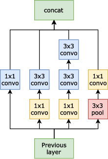
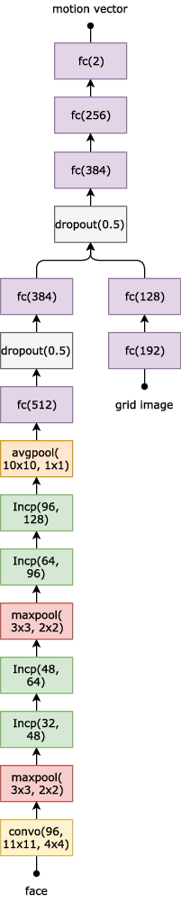

## ETInception

### Inception module used

The factorized version of an inception module[\[1\]][1] is used. It is later used as `Incp(reduce_dim, output_dim)` where `reduce_dim` is the depth to which the `1x1` convolutions will reduce the input and `output_dim` is the output dimension of the `3x3` convolutions which are then concatenated on the last dimension and overall output depth of the inception module is therefore `4 * output_depth`. Strides are `1x1`.



[1]: https://arxiv.org/pdf/1512.00567

## ETInception

In the image below we use the additional notation notation:

* `conv(output_size, kernel_size, stride)`: for 2D convolutional layer of output depth `output_size`,
* `maxpool(kernel_size, stride)`,
* `avgpool(kernel_size, stride)`,
* `dropout(probability)`,
* `fc(output_size)`: for fully-connected layers



### Implementation in tensorflow

```python
import tensorflow as tf
from tensorflow.contrib import slim

def inception_no5x5(input, reduce_dim, output_dim):
    with slim.arg_scope([slim.conv2d, slim.max_pool2d],
                        stride=[1, 1], padding='SAME'):
        with tf.variable_scope("branch1x1"):
            reduce1x1solo = slim.conv2d(input, output_dim, 1)
        with tf.variable_scope("branch3x3_1"):
            reduce1x1conv1 = slim.conv2d(input, reduce_dim, 1)
            conv1 = slim.conv2d(reduce1x1conv1, output_dim, 3)
        with tf.variable_scope("branch3x3_2"):
            reduce1x1conv2 = slim.conv2d(input, reduce_dim, 1)
            conv2 = slim.conv2d(reduce1x1conv2, output_dim, 3)
            conv3 = slim.conv2d(conv2, output_dim, 3)
        with tf.variable_scope("branch_pool"):
            maxpool3x3 = slim.max_pool2d(input, 3)
            reduce1x1maxpool = slim.conv2d(maxpool3x3, output_dim, 1)

        output = tf.concat([reduce1x1solo, conv1, conv3, reduce1x1maxpool], 3)

        return output

with slim.arg_scope([slim.conv2d, slim.fully_connected],
                    activation_fn=tf.nn.elu):
    with slim.arg_scope([slim.conv2d], padding='SAME'):
        with tf.variable_scope('conv-f1'):
            conv = slim.conv2d(input_face, 96, 11, 4)
            pool = slim.max_pool2d(conv, 3, 2)
        with tf.variable_scope('incp-f1a'):
            conv = inception_no5x5(pool, 32, 48)
        with tf.variable_scope('incp-f2a'):
            conv = inception_no5x5(conv, 48, 64)
            pool = slim.max_pool2d(conv, 3, 2)
        with tf.variable_scope('incp-f1b'):
            conv = inception_no5x5(pool, 64, 96)
        with tf.variable_scope('incp-f2b'):
            conv = inception_no5x5(conv, 96, 128)
            pool = slim.avg_pool2d(conv, 10, 1)

    with tf.variable_scope('fc-fg1'):
        grid_fully = slim.fully_connected(slim.flatten(input_grid), 192)
    with tf.variable_scope('fc-fg2'):
        grid_fully = slim.fully_connected(grid_fully, 128)

    with tf.variable_scope('fc-f1'):
        fully = slim.fully_connected(slim.flatten(conv), 512)
        drop = slim.dropout(fully, is_training=is_training)
    with tf.variable_scope('fc-f2'):
        fully = slim.fully_connected(drop, 384)

    concat = tf.concat([fully, grid_fully], 1)
    drop = slim.dropout(concat, is_training=True)

    with tf.variable_scope('fc1'):
        fully = slim.fully_connected(drop, 256)
    with tf.variable_scope('fc3'):
        fully = slim.fully_connected(fully, 2)

gaze = fully
```

## References

1. Szegedy, C., Vanhoucke, V., Ioffe, S., Shlens, J., Wojna, Z.: Rethinking the Inception Architecture for Computer Vision. 2016 IEEE Conference on Computer Vision and Pattern Recognition (CVPR), 2016, pp. 2818–2826.
